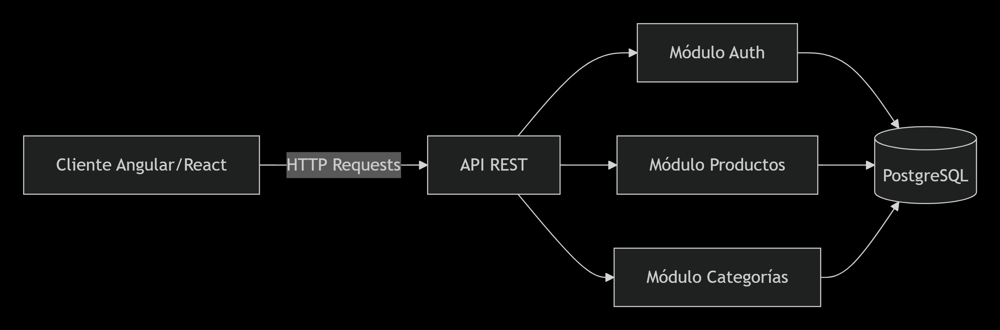
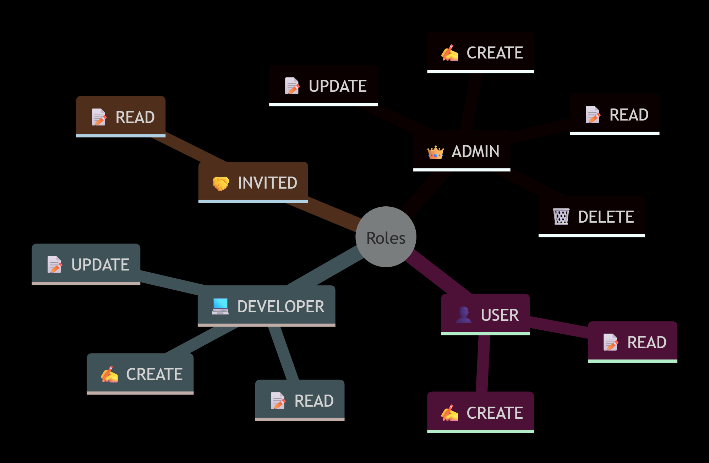
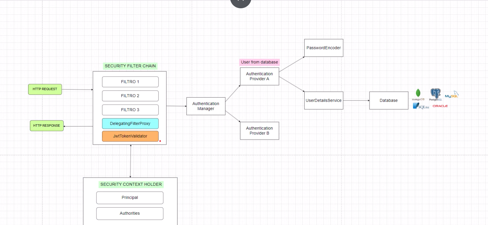

Una API REST robusta y segura para gestión de tienda con autenticación JWT y control de acceso por roles

🚀 **Características •**  
📚 **Documentación API •**  
🔐 **Seguridad •**  
⚙️ **Instalación**

📋 **Tabla de Contenido**

1. 🎯 Descripción General  
2. ✨ Características Principales  
3. 🏗️ Arquitectura del Proyecto  
4. 💻 Tecnologías Utilizadas  
5. 🔐 Modelo de Seguridad  
6. 🛠️ API Endpoints  
7. 📂 Estructura de Archivos  
8. 🗄️ Base de Datos  
9. ⚙️ Instalación y Ejecución  
10. ⚠️ Manejo de Excepciones  
11. 🌟 Buenas Prácticas  
12. 👥 Autores

🎯 **Descripción General**

CRUD Store es una aplicación **backend** desarrollada con **Spring Boot** que proporciona una **API REST completa** para la gestión de un **catálogo de productos** organizados por categorías.  

El sistema implementa un **modelo de seguridad avanzado** basado en **JWT (JSON Web Tokens)** con un sistema **granular de roles y permisos**.

✨ **Características Principales**

| Funcionalidad        | Estado    | Descripción                                     |
|---------------------|-----------|-------------------------------------------------|
| ✅ CRUD Productos    | Completo  | Gestión completa de productos con soft delete |
| ✅ CRUD Categorías   | Completo  | Organización de productos por categorías      |
| ✅ Autenticación JWT | Completo  | Sistema seguro basado en tokens               |
| ✅ Roles y Permisos  | Completo  | Control de acceso granular (RBAC)            |
| ✅ Validaciones      | Completo  | Validación en todas las capas                 |
| ✅ Documentación     | Completo  | Código autodocumentado y README               |
| ✅ Soft Delete       | Completo  | Eliminación lógica para preservar datos       |
| ✅ CORS Configurado  | Completo  | Comunicación con frontend Angular             |

🏗️ **Arquitectura del Proyecto**
El proyecto sigue una arquitectura hexagonal (puertos y adaptadores) organizada en módulos funcionales:

~~~
┌─────────────────────────────────────────────────────────────┐
│                       🌐 API LAYER                           │
│  ┌──────────────┐  ┌──────────────┐  ┌──────────────┐      │
│  │ Controllers  │  │     DTOs     │  │  Validation  │      │
│  └──────────────┘  └──────────────┘  └──────────────┘      │
├─────────────────────────────────────────────────────────────┤
│                    ⚙️ APPLICATION LAYER                      │
│  ┌──────────────┐  ┌──────────────┐  ┌──────────────┐      │
│  │   Services   │  │   Use Cases  │  │  Exceptions  │      │
│  └──────────────┘  └──────────────┘  └──────────────┘      │
├─────────────────────────────────────────────────────────────┤
│                      📦 DOMAIN LAYER                         │
│  ┌──────────────┐  ┌──────────────┐  ┌──────────────┐      │
│  │   Entities   │  │    Enums     │  │  Repository  │      │
│  │              │  │              │  │  Interfaces  │      │
│  └──────────────┘  └──────────────┘  └──────────────┘      │
├─────────────────────────────────────────────────────────────┤
│                 🔧 INFRASTRUCTURE LAYER                      │
│  ┌──────────────┐  ┌──────────────┐  ┌──────────────┐      │
│  │ Repositories │  │   Security   │  │  JPA/Hibernate│      │
│  └──────────────┘  └──────────────┘  └──────────────┘      │
└─────────────────────────────────────────────────────────────┘
~~~

📁 **Estructura por Módulos**
~~~
📦 crudstore-backend/
├── 📁 src/main/java/com/mglopez/crudstore/
│   ├── 📁 config/                    # Configuraciones globales
│   │   ├── 📄 CorsConfig.java        # Configuración CORS
│   │   └── 📄 DataInitializer.java   # Datos iniciales automáticos
│   ├── 📁 modules/                    # Módulos funcionales
│   │   ├── 📁 auth/                    # 🔐 Módulo de autenticación
│   │   ├── 📁 categoria/                # 📂 Módulo de categorías
│   │   └── 📁 producto/                 # 📦 Módulo de productos
│   └── 📁 shared/                      # Código compartido
│       └── 📁 exception/                # Manejo global de errores
└── 📁 src/main/resources/
    ├── 📄 application.properties       # Configuración de la app
    └── 📁 exception/                    # Clases de excepción
~~~

💻 **Tecnologías Utilizadas**

🛠 **Tecnologías Utilizadas**

| Tecnología          | Versión  | Icono | Propósito                    |
|--------------------|----------|-------|-------------------------------|
| Java               | 17       |  | Lenguaje principal          |
| Spring Boot        | 4.0.2    |  | Framework base              |
| Spring Security    | 6.x      |  | Autenticación               |
| Spring Data JPA    | 3.x      |  | Persistencia                |
| JWT (Auth0)        | 4.5.0    |  | Tokens                      |
| PostgreSQL         | 15.x     |  | Base de datos               |
| Lombok             | 1.18.30  |  | Código limpio               |
| Maven              | 3.8.x    |  | Build tool                  |
| Bean Validation    | 3.x      |  | Validaciones               |

📦 **Dependencias Principales (pom.xml)**

~~~
<dependencies>
    <!-- Spring Boot Starters -->
    <dependency>
        <groupId>org.springframework.boot</groupId>
        <artifactId>spring-boot-starter-data-jpa</artifactId>
    </dependency>
    <dependency>
        <groupId>org.springframework.boot</groupId>
        <artifactId>spring-boot-starter-security</artifactId>
    </dependency>
    <dependency>
        <groupId>org.springframework.boot</groupId>
        <artifactId>spring-boot-starter-validation</artifactId>
    </dependency>
    
    <!-- JWT -->
    <dependency>
        <groupId>com.auth0</groupId>
        <artifactId>java-jwt</artifactId>
        <version>4.5.0</version>
    </dependency>
    
    <!-- PostgreSQL -->
    <dependency>
        <groupId>org.postgresql</groupId>
        <artifactId>postgresql</artifactId>
        <scope>runtime</scope>
    </dependency>
    
    <!-- Lombok -->
    <dependency>
        <groupId>org.projectlombok</groupId>
        <artifactId>lombok</artifactId>
        <optional>true</optional>
    </dependency>
</dependencies>
~~~

🔐 **Modelo de Seguridad**
El sistema implementa un modelo de seguridad RBAC (Role-Based Access Control) con permisos granulares:

📊 **Matriz de Acceso**

📊 **Matriz de Acceso**

| Rol       | READ | CREATE | UPDATE | DELETE |
|-----------|------|--------|--------|--------|
| ADMIN     | ✅   | ✅     | ✅     | ✅     |
| USER      | ✅   | ✅     | ❌     | ❌     |
| DEVELOPER | ✅   | ✅     | ✅     | ❌     |
| INVITED   | ✅   | ❌     | ❌     | ❌     |

🔄 Flujo de Autenticación

