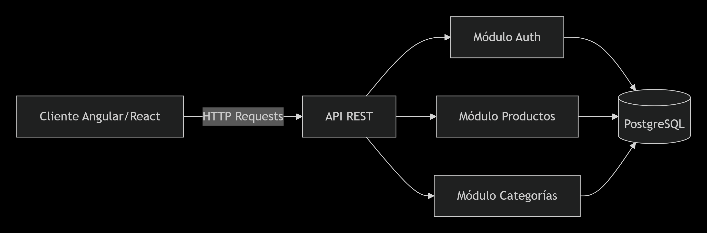
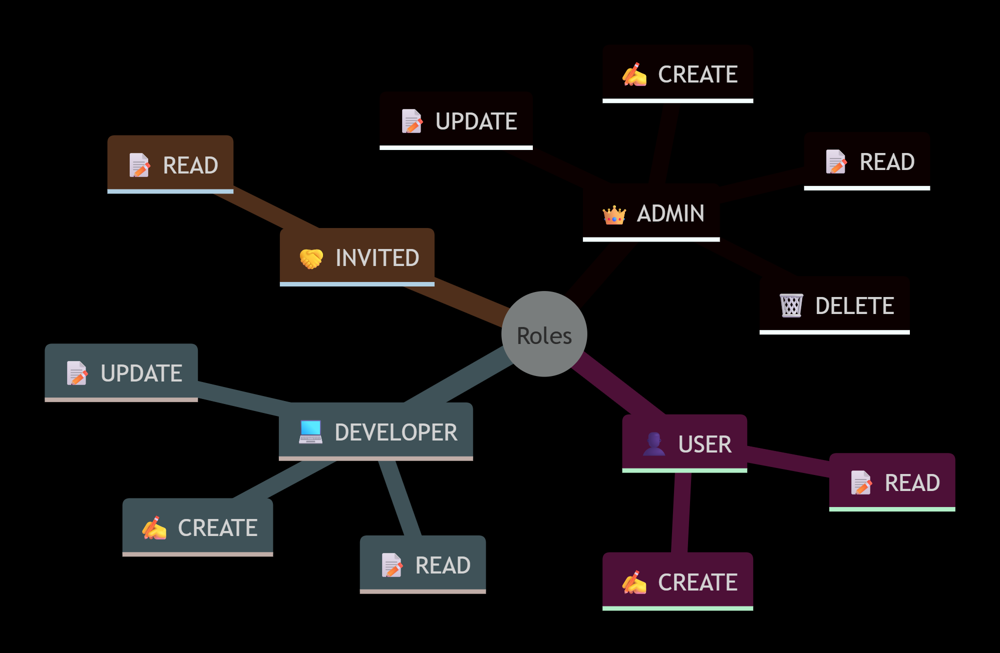
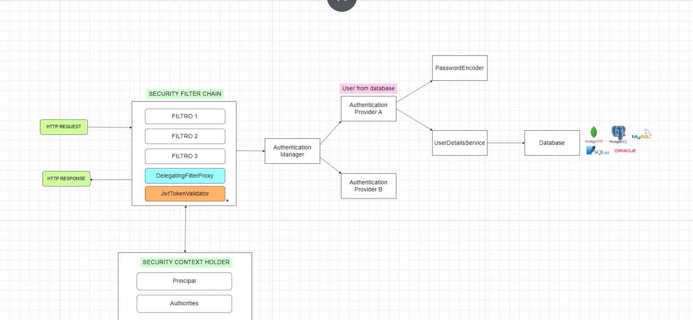
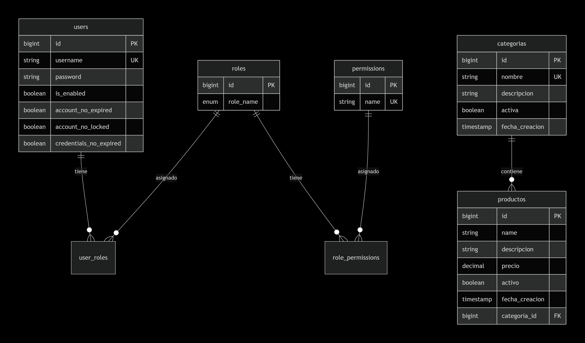
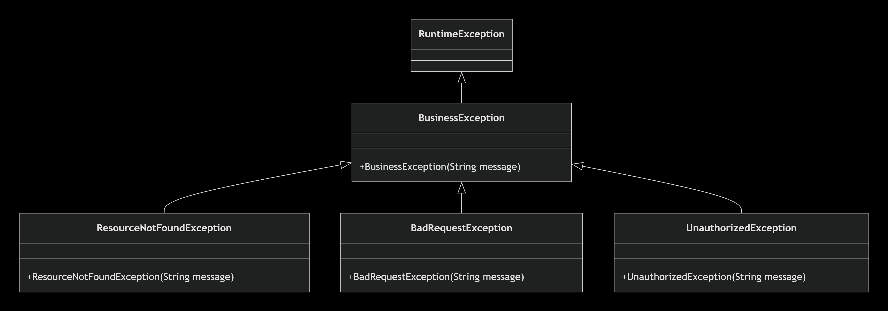

Una API REST robusta y segura para gestión de tienda con autenticación JWT y control de acceso por roles

!Nota se recomienda usar solo el backend con Postman el frontend estara disponible proximamente.

🚀 **Características •**  
📚 **Documentación API •**  
🔐 **Seguridad •**  
⚙️ **Instalación**

# 📋 Tabla de Contenido

1. 🎯 Descripción General  
2. ✨ Características Principales  
3. 🏗️ Arquitectura del Proyecto  
4. 💻 Tecnologías Utilizadas  
5. 🔐 Modelo de Seguridad  
6. 📍 API Endpoints  
7. 📂 Estructura de Archivos  
8. 🗄️ Base de Datos  
9. ⚙️ Instalación y Ejecución  
10. ⚠️ Manejo de Excepciones  
11. 🌟 Buenas Prácticas  
12. 👥 Autores

🎯 **Descripción General**

CRUD Store es una aplicación **backend** desarrollada con **Spring Boot** que proporciona una **API REST completa** para la gestión de un **catálogo de productos** organizados por categorías.  

El sistema implementa un **modelo de seguridad avanzado** basado en **JWT (JSON Web Tokens)** con un sistema **granular de roles y permisos**.

✨ **Características Principales**

| Funcionalidad        | Estado    | Descripción                                     |
|---------------------|-----------|-------------------------------------------------|
| ✅ CRUD Productos    | Completo  | Gestión completa de productos con soft delete |
| ✅ CRUD Categorías   | Completo  | Organización de productos por categorías      |
| ✅ Autenticación JWT | Completo  | Sistema seguro basado en tokens               |
| ✅ Roles y Permisos  | Completo  | Control de acceso granular (RBAC)            |
| ✅ Validaciones      | Completo  | Validación en todas las capas                 |
| ✅ Documentación     | Completo  | Código autodocumentado y README               |
| ✅ Soft Delete       | Completo  | Eliminación lógica para preservar datos       |
| ✅ CORS Configurado  | Completo  | Comunicación con frontend Angular             |

🏗️ **Arquitectura del Proyecto**
El proyecto sigue una arquitectura hexagonal (puertos y adaptadores) organizada en módulos funcionales:

~~~
┌─────────────────────────────────────────────────────────────┐
│                       🌐 API LAYER                           │
│  ┌──────────────┐  ┌──────────────┐  ┌──────────────┐      │
│  │ Controllers  │  │     DTOs     │  │  Validation  │      │
│  └──────────────┘  └──────────────┘  └──────────────┘      │
├─────────────────────────────────────────────────────────────┤
│                    ⚙️ APPLICATION LAYER                      │
│  ┌──────────────┐  ┌──────────────┐  ┌──────────────┐      │
│  │   Services   │  │   Use Cases  │  │  Exceptions  │      │
│  └──────────────┘  └──────────────┘  └──────────────┘      │
├─────────────────────────────────────────────────────────────┤
│                      📦 DOMAIN LAYER                         │
│  ┌──────────────┐  ┌──────────────┐  ┌──────────────┐      │
│  │   Entities   │  │    Enums     │  │  Repository  │      │
│  │              │  │              │  │  Interfaces  │      │
│  └──────────────┘  └──────────────┘  └──────────────┘      │
├─────────────────────────────────────────────────────────────┤
│                 🔧 INFRASTRUCTURE LAYER                      │
│  ┌──────────────┐  ┌──────────────┐  ┌──────────────┐      │
│  │ Repositories │  │   Security   │  │  JPA/Hibernate│      │
│  └──────────────┘  └──────────────┘  └──────────────┘      │
└─────────────────────────────────────────────────────────────┘
~~~

📁 **Estructura por Módulos**
~~~
📦 crudstore-backend/
├── 📁 src/main/java/com/mglopez/crudstore/
│   ├── 📁 config/                    # Configuraciones globales
│   │   ├── 📄 CorsConfig.java        # Configuración CORS
│   │   └── 📄 DataInitializer.java   # Datos iniciales automáticos
│   ├── 📁 modules/                    # Módulos funcionales
│   │   ├── 📁 auth/                    # 🔐 Módulo de autenticación
│   │   ├── 📁 categoria/                # 📂 Módulo de categorías
│   │   └── 📁 producto/                 # 📦 Módulo de productos
│   └── 📁 shared/                      # Código compartido
│       └── 📁 exception/                # Manejo global de errores
└── 📁 src/main/resources/
    ├── 📄 application.properties       # Configuración de la app
    └── 📁 exception/                    # Clases de excepción
~~~

💻 **Tecnologías Utilizadas**

🛠 **Tecnologías Utilizadas**

| Tecnología          | Versión  | Icono | Propósito                    |
|--------------------|----------|-------|-------------------------------|
| Java               | 17       |  | Lenguaje principal          |
| Spring Boot        | 4.0.2    |  | Framework base              |
| Spring Security    | 6.x      |  | Autenticación               |
| Spring Data JPA    | 3.x      |  | Persistencia                |
| JWT (Auth0)        | 4.5.0    |  | Tokens                      |
| PostgreSQL         | 15.x     |  | Base de datos               |
| Lombok             | 1.18.30  |  | Código limpio               |
| Maven              | 3.8.x    |  | Build tool                  |
| Bean Validation    | 3.x      |  | Validaciones               |

📦 **Dependencias Principales (pom.xml)**

~~~
<dependencies>
    <!-- Spring Boot Starters -->
    <dependency>
        <groupId>org.springframework.boot</groupId>
        <artifactId>spring-boot-starter-data-jpa</artifactId>
    </dependency>
    <dependency>
        <groupId>org.springframework.boot</groupId>
        <artifactId>spring-boot-starter-security</artifactId>
    </dependency>
    <dependency>
        <groupId>org.springframework.boot</groupId>
        <artifactId>spring-boot-starter-validation</artifactId>
    </dependency>
    
    <!-- JWT -->
    <dependency>
        <groupId>com.auth0</groupId>
        <artifactId>java-jwt</artifactId>
        <version>4.5.0</version>
    </dependency>
    
    <!-- PostgreSQL -->
    <dependency>
        <groupId>org.postgresql</groupId>
        <artifactId>postgresql</artifactId>
        <scope>runtime</scope>
    </dependency>
    
    <!-- Lombok -->
    <dependency>
        <groupId>org.projectlombok</groupId>
        <artifactId>lombok</artifactId>
        <optional>true</optional>
    </dependency>
</dependencies>
~~~

🔐 **Modelo de Seguridad**
El sistema implementa un modelo de seguridad RBAC (Role-Based Access Control) con permisos granulares:

📊 **Matriz de Acceso**

📊 **Matriz de Acceso**

| Rol       | READ | CREATE | UPDATE | DELETE |
|-----------|------|--------|--------|--------|
| ADMIN     | ✅   | ✅     | ✅     | ✅     |
| USER      | ✅   | ✅     | ❌     | ❌     |
| DEVELOPER | ✅   | ✅     | ✅     | ❌     |
| INVITED   | ✅   | ❌     | ❌     | ❌     |

🔄 Flujo de Autenticación

🎫 **Estructura del Token JWT**
~~~
{
  "iss": "AUTHOJWT-BACKEND",
  "sub": "admin",
  "authorities": "ROLE_ADMIN,READ,CREATE,UPDATE,DELETE",
  "iat": 1640995200,
  "exp": 1640997000,
  "jti": "550e8400-e29b-41d4-a716-446655440000"
}
~~~

📍 **API Endpoints**

🔑 **Autenticación (`/auth`)**

| Método | Endpoint    | Descripción          | Request Body          | Response          | Código |
|--------|------------|--------------------|---------------------|-----------------|--------|
| POST   | /sign-up   | Registrar nuevo usuario | `AuthCreateUserDTO` | `AuthResponseDTO` | 201    |
| POST   | /log-in    | Iniciar sesión        | `AuthLoginRequestDTO` | `AuthResponseDTO` | 200    |

  
<b>📝 Ejemplo de Request/Response</b>

~~~
json
// Request ejemplo para /sign-up
{
  "username": "juan123",
  "email": "juan@example.com",
  "password": "********"
}

// Response ejemplo para /sign-up
{
  "token": "eyJhbGciOiJIUzI1NiIsInR5cCI6IkpXVCJ9...",
  "username": "juan123",
  "roles": ["USER"]
}

// Request ejemplo para /log-in
{
  "username": "juan123",
  "password": "********"
}

// Response ejemplo para /log-in
{
  "token": "eyJhbGciOiJIUzI1NiIsInR5cCI6IkpXVCJ9...",
  "username": "juan123",
  "roles": ["USER"]
}
~~~

📂 **Categorías** (/api/categorias)

| Método | Endpoint       | Descripción                  | Permiso Requerido | Código |
|--------|----------------|------------------------------|-----------------|--------|
| GET    | /              | Listar categorías activas    | READ            | 200    |
| GET    | /{id}          | Obtener categoría por ID     | READ            | 200    |
| POST   | /create        | Crear categoría              | CREATE          | 201    |
| PUT    | /{id}          | Actualizar categoría         | UPDATE          | 200    |
| DELETE | /{id}          | Eliminar (desactivar) categoría | DELETE       | 204    |

 
<b>📝 Ejemplos</b>

    
**Crear Categoría:**
~~~
POST /api/categorias/create
{
  "nombre": "Electrónica",
  "descripcion": "Dispositivos electrónicos y gadgets"
}
~~~
**Response:**
~~~
{
  "id": 1,
  "nombre": "Electrónica",
  "descripcion": "Dispositivos electrónicos y gadgets",
  "activa": true,
  "fechaCreacion": "2024-01-15T10:30:00"
}
~~~

📦 **Productos** (/api/productos)

| Método | Endpoint                    | Descripción                  | Permiso Requerido | Código |
|--------|-----------------------------|------------------------------|-----------------|--------|
| GET    | /                           | Listar productos activos     | Autenticación   | 200    |
| GET    | /{id}                       | Obtener producto por ID      | Autenticación   | 200    |
| GET    | /categoria/{categoriaId}    | Productos por categoría      | Autenticación   | 200    |
| POST   | /                           | Crear producto               | Autenticación   | 201    |
| PUT    | /{id}                       | Actualizar producto          | Autenticación   | 200    |
| DELETE | /{id}                       | Eliminar (desactivar) producto | Autenticación | 204    |

 
<b>📝 Ejemplos</b>

**Crear Producto:**
POST /api/productos
~~~
{
  "name": "Laptop Gamer",
  "descripcion": "Laptop con RTX 4060, 16GB RAM",
  "precio": 1299.99,
  "categoriaId": 1
}
~~~
**Response:**
~~~
{
  "id": 1,
  "name": "Laptop Gamer",
  "descripcion": "Laptop con RTX 4060, 16GB RAM",
  "precio": 1299.99,
  "activo": true,
  "categoriaId": 1,
  "categoriaNombre": "Electrónica",
  "fechaCreacion": "2024-01-15T10:35:00"
}
~~~

📊 **Base de Datos**

⚙️ **Instalación y Ejecución**
📋 Prerrequisitos
☕ JDK 17 o superior

🐘 Maven 3.8+

🐘 PostgreSQL 15+

🔧 IDE (IntelliJ IDEA, Eclipse, VS Code)

📬 Postman o similar (para pruebas)

🚀 **Pasos de Instalación**

1️⃣ Clonar el repositorio
~~~
git clone https://github.com/tu-usuario/crudstore-backend.git
cd crudstore-backend
~~~
2️⃣ Configurar la base de datos
~~~
-- Conectar a PostgreSQL
sudo -u postgres psql

-- Crear base de datos
CREATE DATABASE crudstore_db;

-- Salir
\q
~~~
3️⃣ Configurar application.properties
~~~
# DATA BASE CONFIGURATION
spring.datasource.url=jdbc:postgresql://localhost:5432/crudstore_db
spring.datasource.username=postgres
spring.datasource.password=tu_contraseña
spring.datasource.driver-class-name=org.postgresql.Driver

# JPA/HIBERNATE CONFIGURATION
spring.jpa.hibernate.ddl-auto=update
spring.jpa.show-sql=true
spring.jpa.properties.hibernate.dialect=org.hibernate.dialect.PostgreSQLDialect
spring.jpa.properties.hibernate.format_sql=true

# SERVER CONFIGURATION
server.port=9525

# JWT SECURITY
security.jwt.key.private=13e84f751d69db68ab9a6a4e46b6f1c7ea3373482549e791b991d09de2d911a8
security.jwt.user.generator=AUTHOJWT-BACKEND
~~~
4️⃣ Compilar y ejecutar
~~~
# Limpiar y compilar
mvn clean install

# Ejecutar la aplicación
mvn spring-boot:run
~~~
5️⃣ Verificar la instalación
~~~
# La aplicación debería estar corriendo en:
curl http://localhost:9525/actuator/health

# Respuesta esperada:
{"status":"UP"}
~~~
🐳 Ejecución con Docker (Aun no implementado, proximamente...)

🚨 **Manejo de Excepciones**

🎯 **Tipos de Excepción**

| Excepción                         | Código HTTP | Cuándo ocurre                           | Ejemplo                                  |
|----------------------------------|------------|----------------------------------------|-----------------------------------------|
| ResourceNotFoundException         | 404        | Recurso no encontrado                  | Producto no encontrado con ID: 999      |
| BadRequestException               | 400        | Datos inválidos o duplicados           | La categoría ya existe: Electrónica     |
| BadCredentialsException           | 401        | Credenciales incorrectas               | Invalid username or password            |
| UsernameNotFoundException         | 401        | Usuario no existe                      | El usuario admin no existe              |
| MethodArgumentNotValidException   | 400        | Validación de DTO falla                | name no puede estar vacío               |

📝 Formato de Respuesta de Error

~~~
{
  "timestamp": "2024-01-15T10:30:45.123",
  "status": 404,
  "error": "RESOURCE_NOT_FOUND",
  "message": "Producto no encontrado con ID: 999"
}
~~~

✨ **Buenas Prácticas**

🎨 **Código Limpio**

| Práctica       | Implementación      | Beneficio                     |
|----------------|-------------------|-------------------------------|
| DTOs           | Records de Java    | Inmutabilidad y código conciso |
| Lombok         | `@Data`, `@Builder` | Reduce boilerplate           |
| Documentación  | Comentarios Javadoc | Código autodocumentado       |
| Validaciones   | Bean Validation    | Datos consistentes            |

👨‍💻 **Autor**

**Miguel López** - Desarrollador Backend  

  
  
  

⭐ **Si te gusta este proyecto, ¡no olvides darle una estrella!** ⭐  

[⬆️ Volver al inicio](#-tabla-de-contenido)

